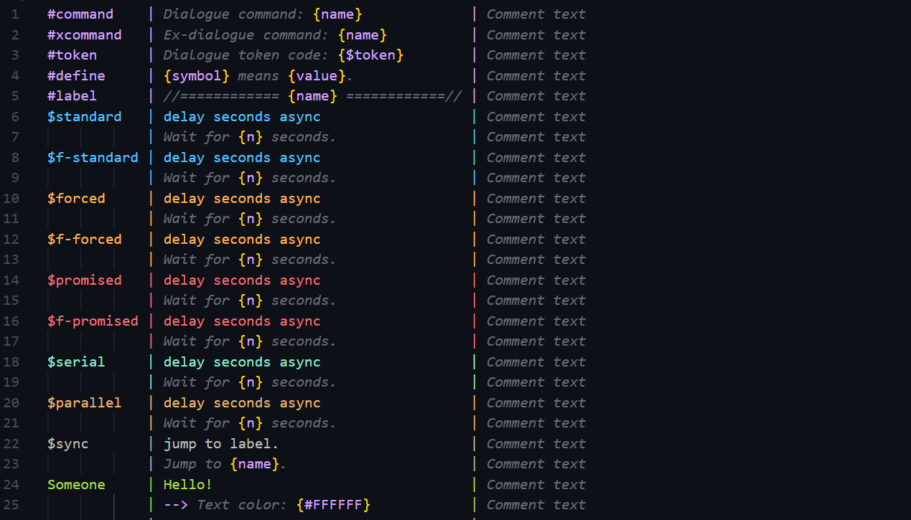

# SFText Syntax

This extension provides syntax highlighting for SFText in ScenarioFlow. See [here](https://github.com/dotprologue/ScenarioFlow.git) for details about ScenarioFlow.

The following example uses [Ayu](https://github.com/ayu-theme/vscode-ayu.git) theme.

